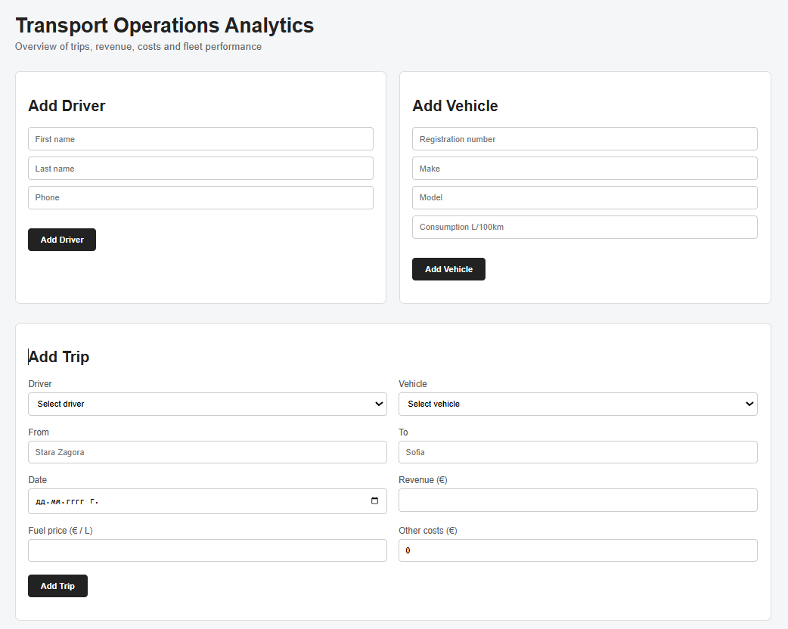
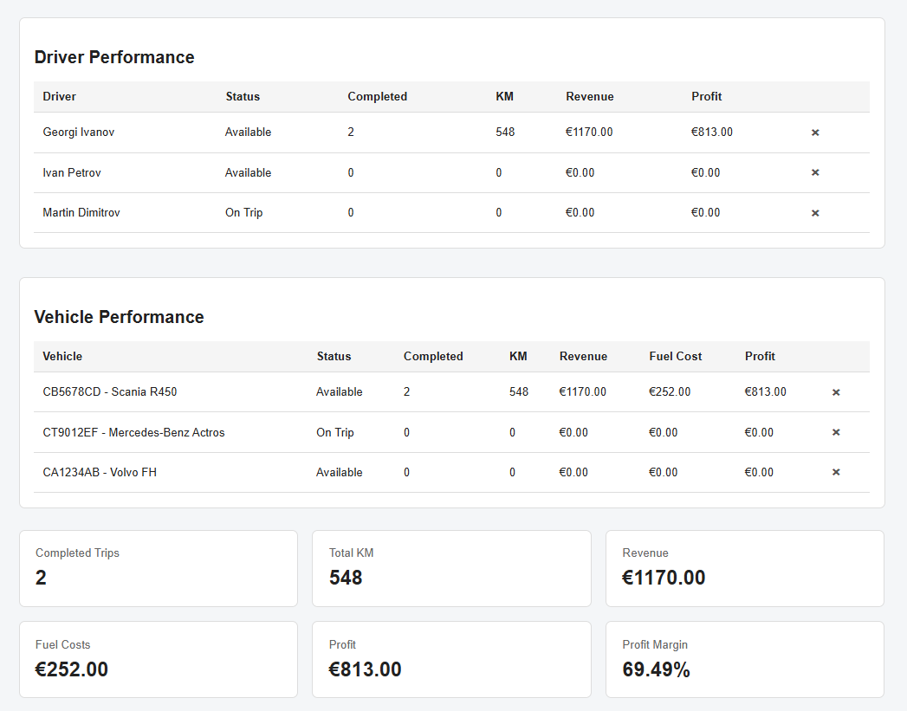
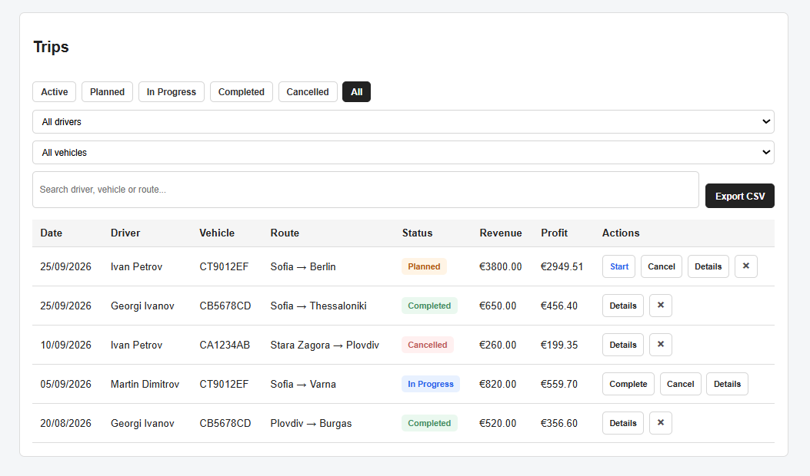
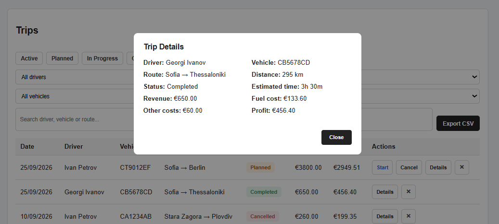

# Transport Operations Analytics

A small full-stack project for managing transport trips, drivers and vehicles.

I built it mainly to practice JavaScript, Node.js, PostgreSQL and SQL in a project with more realistic business logic instead of a simple CRUD application.

## Features

- Manage drivers and vehicles
- Create and track transport trips
- Route distance and estimated travel time
- Fuel cost calculation based on vehicle consumption
- Revenue, costs and profit calculation
- Trip statuses: Planned, In Progress, Completed and Cancelled
- Start, completion and cancellation timestamps
- Cancellation reason
- Driver and vehicle availability
- Trip filtering and search
- Trip details view
- CSV export of filtered trips
- Driver and vehicle performance statistics
- Backend validation and PostgreSQL constraints

## Tech Stack

- JavaScript
- Node.js
- Express.js
- PostgreSQL
- SQL
- HTML
- CSS
- REST APIs
- Open-Meteo Geocoding API
- openrouteservice API

## How it works

The frontend communicates with a Node.js / Express REST API.

Trip, driver and vehicle data is stored in PostgreSQL.

When a trip is created, the application uses external APIs to find the coordinates of the origin and destination and calculate the route distance and estimated travel time.

The selected vehicle's average fuel consumption is then used to estimate the fuel cost for the trip.

Trips follow a simple status flow:

```text
Planned -> In Progress -> Completed
   |             |
   +----------> Cancelled
```

Starting, completing or cancelling a trip automatically saves the relevant timestamp.

A driver or vehicle with an active trip is shown as `On Trip`. Otherwise it is shown as `Available`.

The dashboard statistics use completed trips for the financial calculations.

## Screenshots

### Dashboard



### Driver and Vehicle Performance



### Trips Dashboard and Export



### Trip Details



## Database

The application uses three main tables:

```text
drivers
vehicles
trips
```

Trips are connected to drivers and vehicles using foreign keys.

The database also contains constraints for important rules such as valid trip statuses and preventing the same driver or vehicle from having more than one active trip.

## API

Main routes:

```text
GET    /api/drivers
POST   /api/drivers
DELETE /api/drivers/:id

GET    /api/vehicles
POST   /api/vehicles
DELETE /api/vehicles/:id

GET    /api/trips
POST   /api/trips
PATCH  /api/trips/:id/status
DELETE /api/trips/:id

GET    /api/analytics/summary
GET    /api/analytics/drivers
GET    /api/analytics/vehicles
```

## Run locally

Install the dependencies:

```bash
npm install
```

Create a PostgreSQL database:

```text
transport_operations
```

Run the schema:

```bash
psql -U postgres -d transport_operations -f sql/schema.sql
```

Optional demo data:

```bash
psql -U postgres -d transport_operations -f sql/demo-data.sql
```

Create a `.env` file using `.env.example` and add your database details and openrouteservice API key.

Start the server:

```bash
npm run dev
```

Then open:

```text
http://localhost:3000
```